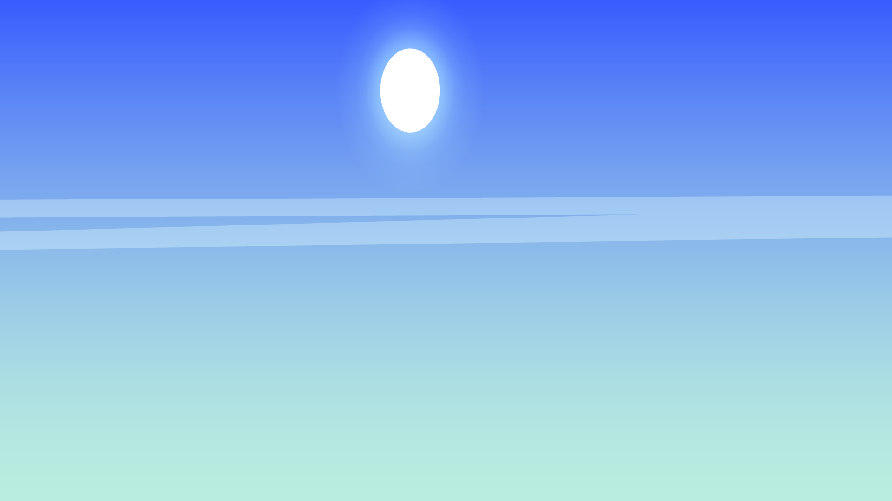
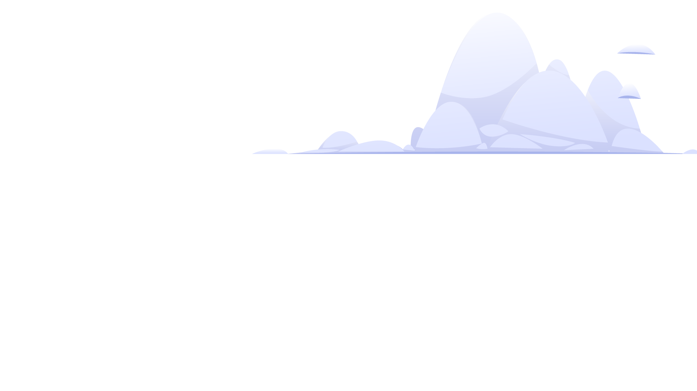
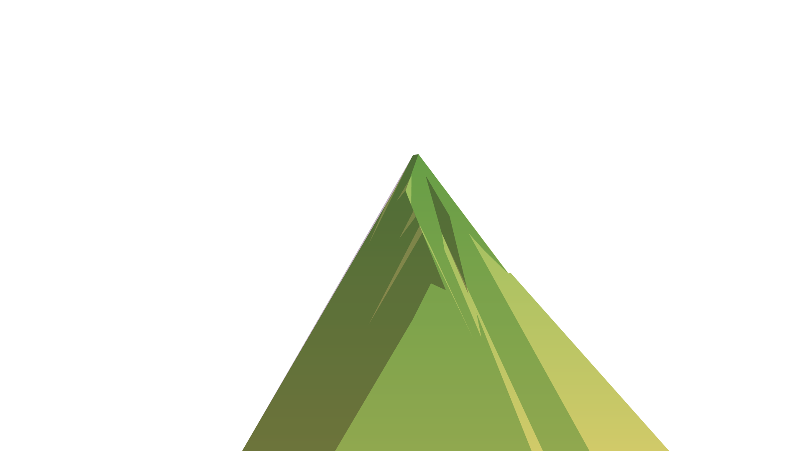
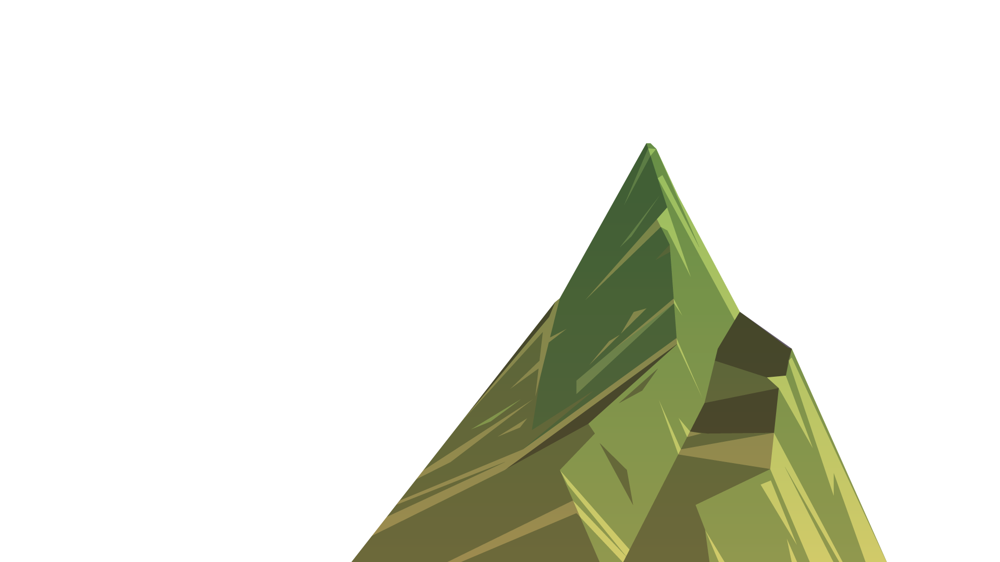
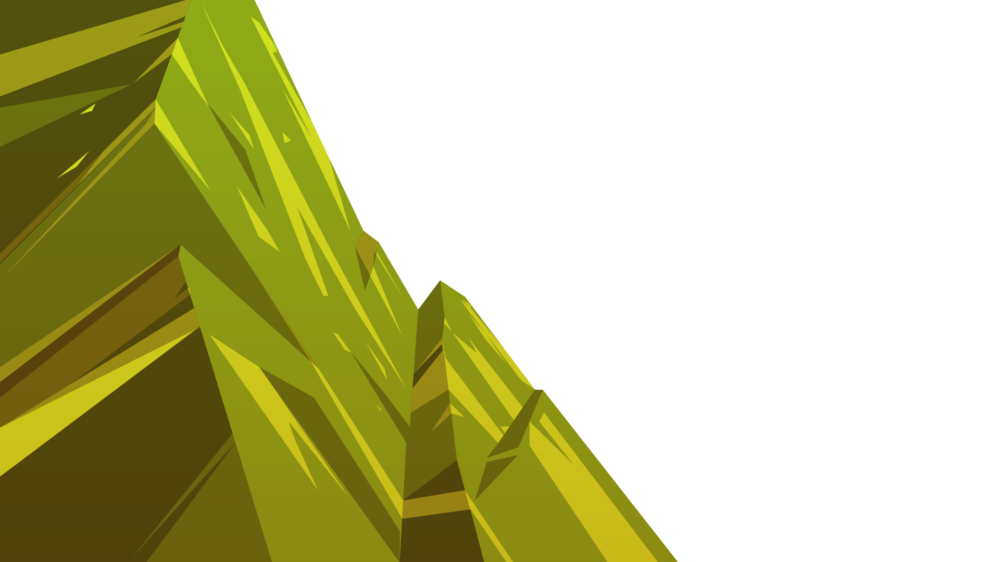
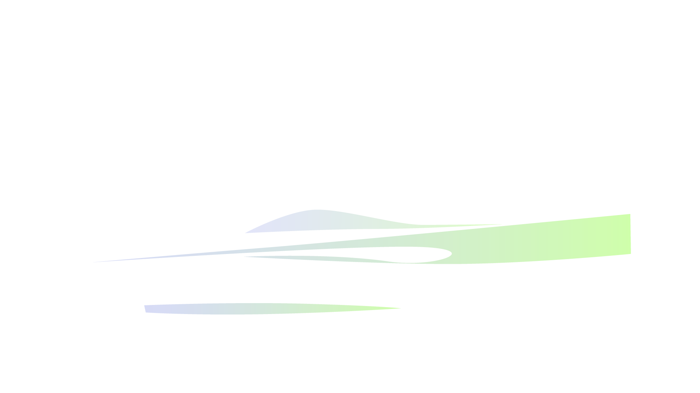
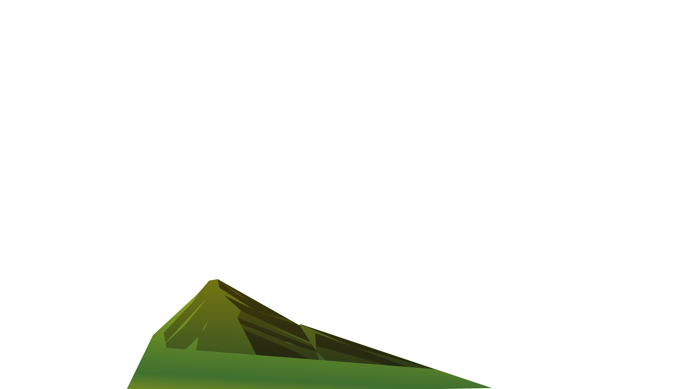
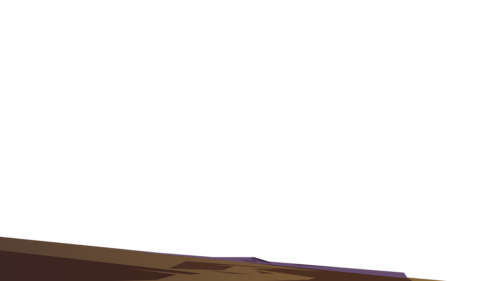
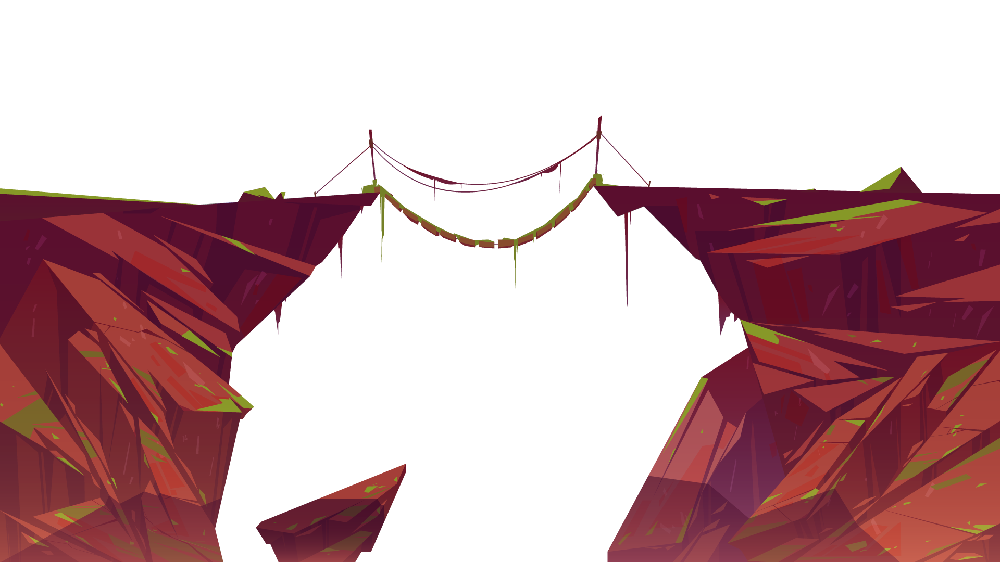

# ACTIVIDAD-7-PARALLAX
<!DOCTYPE html>
<html lang="es">
<head>
<meta charset="UTF-8">
<title>Parallax</title>

</head>

<body>

    
    
    
    
    
    
    
    
    

</body>
</html>
